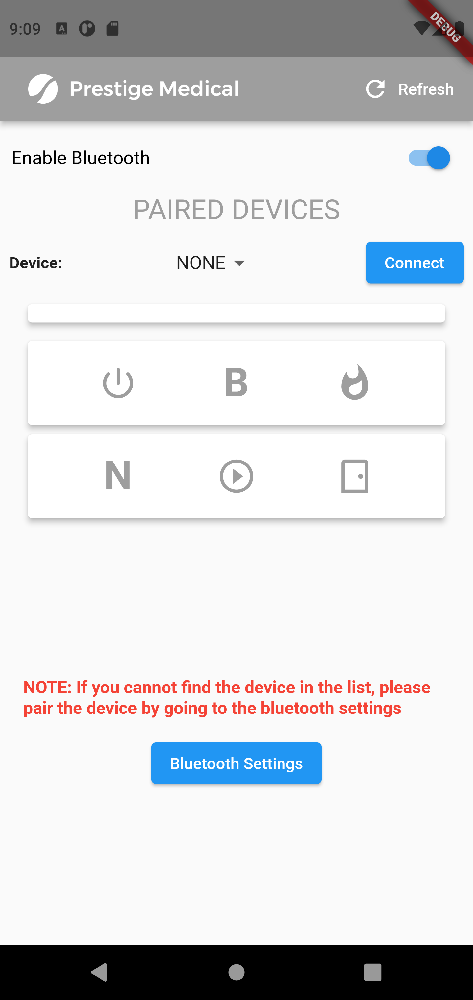
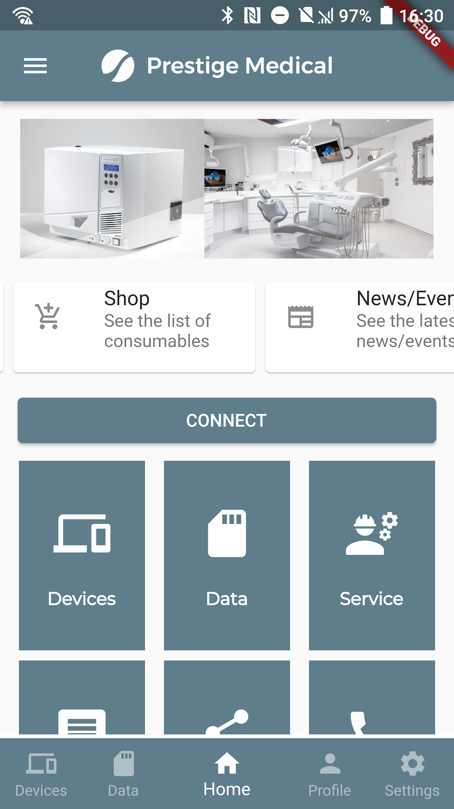
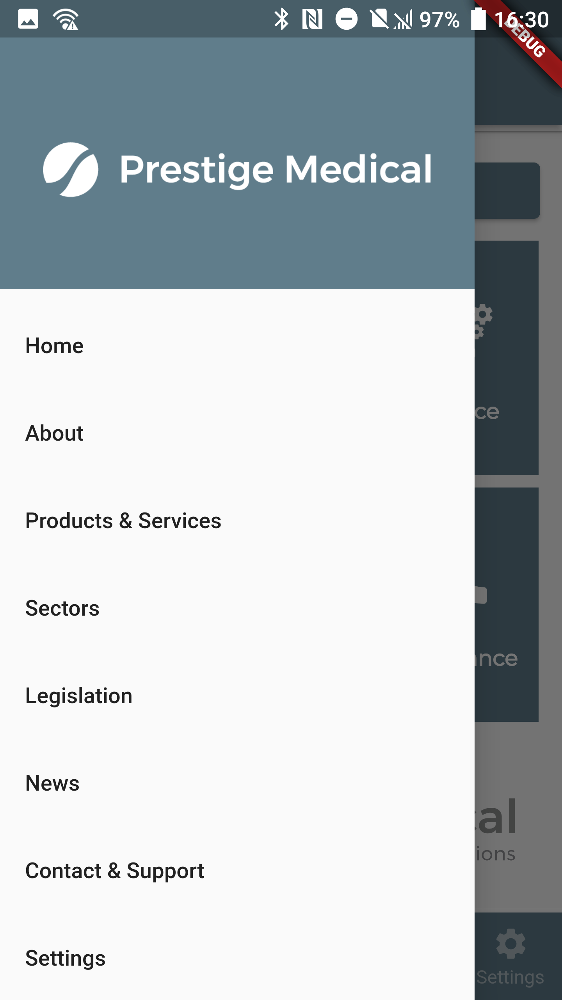
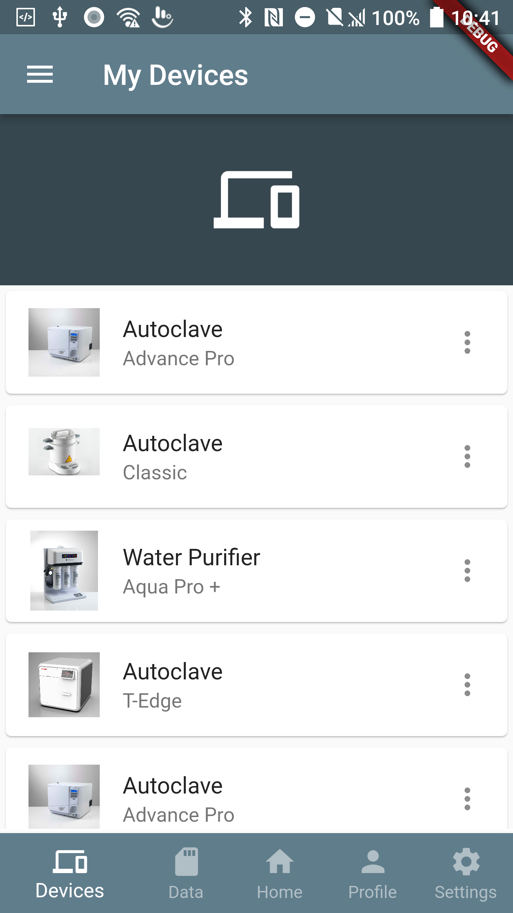

# Company App

 ----------------------------------------------------------------------------
                         Prestige Medical Ltd.                             
                        East House, Duttons Way                            
                             Blackburn,                                    
                            Lancashire,                                    
                                UK.                                        
                              BB1 2QR                                      
                                                                           
        (c) Copyright 2016, Prestige Medical Ltd., Blackburn, UK.          
                                                                           
 ----------------------------------------------------------------------------
  Packet Communication Interface
  Main Header
 ----------------------------------------------------------------------------
 
  Author:    Joshua Longhurst MSc BEng
  Created:   April 2022
 
 ----------------------------------------------------------------------------

## Table of contents

* [Introduction](#introduction)
* [Features](#features)
* [Requirements to run](#requirements-to-run)
* [Examples](#examples)
* [To-do list](#to-do-list)
* [Credits](#credits)

## Introduction ##

A prototype app for [Prestige Medical](https://www.prestigemedical.co.uk/) to allow customers to connect to their devices and view new products and services. 

## Features ##

The first goal of this project, started by [Joshua Longhurst](https://github.com/longhurstj) was making an interface for wireless serial communication between customer devices and office database. Now the repo features:

+ Device status monitoring,

+ Turning device on and off,

+ Opening settings,

+ Discovering devices (and requesting discoverability),

+ Listing bonded devices and pairing new ones,

+ Connecting to multiple devices at the same time,

+ Sending and receiving data (multiple connections).

For now there is only Android support.

## Requirements to run ##
* IDE tools are [Visual Studio code](https://flutter.dev/docs/get-started/editor?tab=vscode) and [Android studio](https://flutter.dev/docs/get-started/editor?tab=androidstudio).
* Flutter SDK
  | Channel| Version|
  |--------|--------|
  | Stable | [2.0.2](https://code.visualstudio.com/download)|
  | Beta   | [2.0.2](https://storage.googleapis.com/flutter_infra/releases/beta/windows/flutter_windows_2.0.2-beta.zip)|
* Dart and Flutter add-ons for Visual Studio Code (available via the Visual studio code extension) in Android Studio it available in plugin preference.

## Examples ##

Screenshots taken during the development:

Discovery and Connecting |  Main screen and options  |  Sidebar Options  |  Device List  |
:---:|:---:|:---:|:---:|
  |    |    |  

## To-do list ##

+ Add some utils to easier manage `BluetoothConnection`,
+ Allow connection method/protocol/UUID specification,
+ Recognizing and displaying `BluetoothClass` of device,
+ Auto-update device list,
+ Remote access to device,
+ Live update of consumables on sale,
+ Profile username, password database,
+ Data logging and chart production,

## Credits ##

- [Joshua Longhurst](https://github.com/longhurstj)
